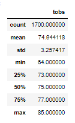
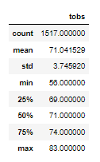

# surfs_up

## Table of Contents
- [Overview of Project](#OverviewProject)
  * [Purpose](#purpose)
- [Results](#Results)
  * [June Results](#JunRes)
  * [December Results](#DecRes)
  * [Results Analysis](#AnRes)
- [Summary](#Summary)
- [Resources](#Resources)

## Overview of Project

This project analyzes the weather in the island of Oahu Hawaii to see if a shop called 'Surf n Shake' would be successful. The shop place would sell icecream and rent surfboards. We will analyze the weather data collected by 9 different stations and stored in a SQLite data base [[1]](#1). We analyzed the data using Python's SQLAlchemy Library [[2]](#2).

### Purpose

The pupose of this analysis is to collect the weather data for the months of June and December for a period of seven years. We will use there two months as samples of the behavior for the summer and winter months. We will then summarize the results by collecting some basic statistical data for those months. 

## Results

### June Results

  

 Figure 1: June Summary Temperature Statistics
 

### December Results

  

 Figure 2: December Summary Temperature Statistics
  

###  Results Analysis

 * The mean value varies about 4 degrees between June and December.
 * The minimum temperature varies 8 degrees between June and December.
 * The maximum temperature varies 2 degrees between June and December.
 * The IQR for June is 4 degrees, while the IQR for December is 5 degrees. 
 * Generally the temperature variation between June and December does not seem to be extreme. December tends to have slightly colder weather. 
 * There's 283 less data points for December compared to June. 
 * The data for both months spans 7 years. 

##  Summary

The temperature variation for the summer months and winter months is not drastic. Icecream sales would not be significantly impacted by temperature alone. Yet, the SQLite Data Base [[1]](#1) does contain precipitation data, and it also captures the stations that are collecting the data. Although we are collecting the information of some of the most extreme weather months, one from winter and one from summer, a more detailed analysis would include all of the months of the year. Additionally, precipitation should be looked into, as rainy weather would impact icecream sales. Finally, we could verify the data coming from each station to confirm the validity of the instrumentation used and check that there aren't any stations capturing erroneous data. 

## Resources

<a name="1">[1]</a> [Hawaii SQLite Temperature Data Base](https://github.com/tamiespinosa/surfs_up/blob/1f6d1fa61caf6a22e5d35e919601ad74e5d26c7d/hawaii.sqlite)

<a name="2">[2]</a> [Code Used for Analysis](https://github.com/tamiespinosa/surfs_up/blob/1f6d1fa61caf6a22e5d35e919601ad74e5d26c7d/SurfsUp_Challenge.ipynb)

[3] https://inloop.github.io/sqlite-viewer/

[4] https://docs.github.com/en/get-started/writing-on-github/getting-started-with-writing-and-formatting-on-github/basic-writing-and-formatting-syntax
